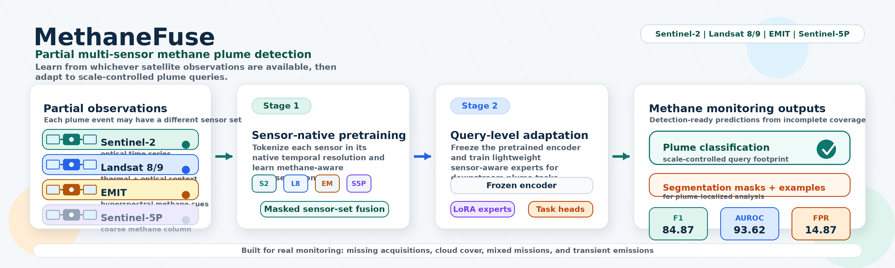
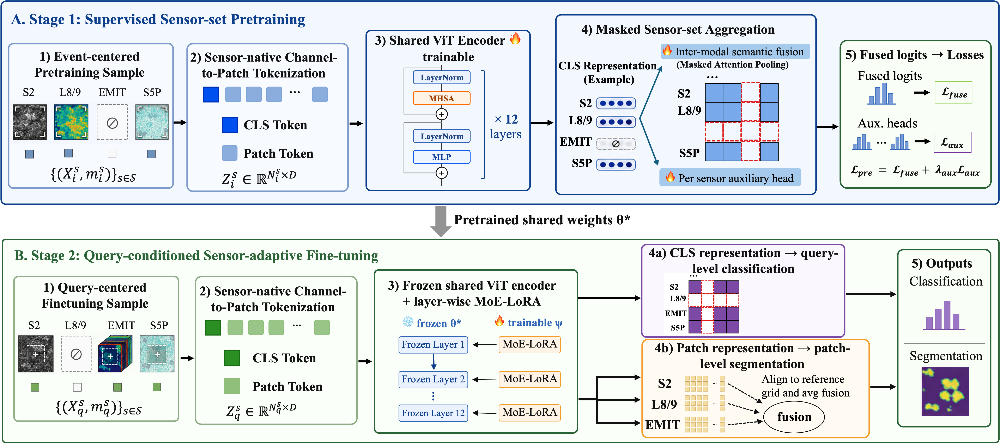
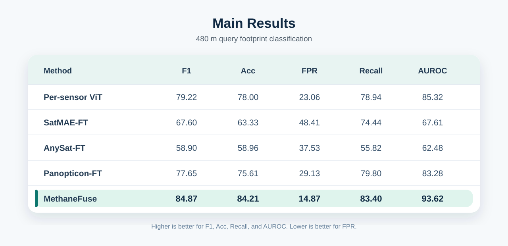
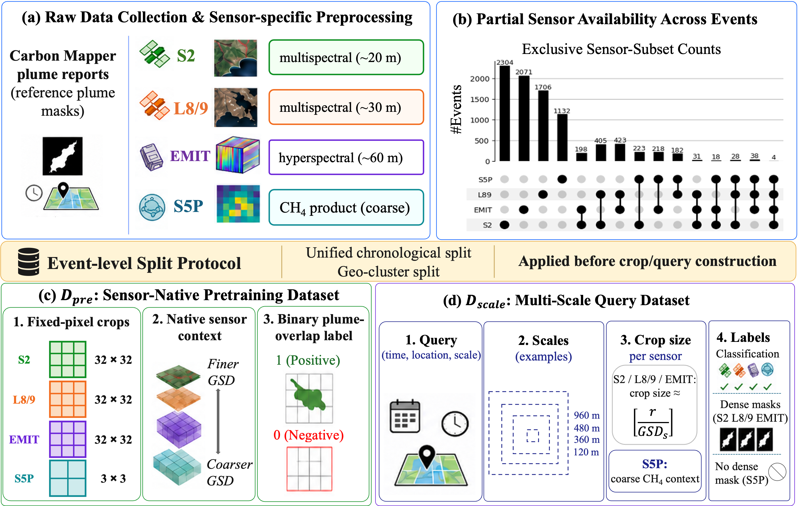

<p align="center">
  
</p>

**MethaneFuse** is a two-stage learning framework for methane plume detection from partial multi-sensor satellite observations. It learns from whichever satellite observations are available for a plume event, including Sentinel-2, Landsat 8/9, EMIT, and Sentinel-5P.

MethaneFuse is built for real methane monitoring settings where satellite coverage is incomplete because of revisit timing, cloud coverage, acquisition quality, mission coverage, and the transient lifetime of methane emissions.

<p align="center">
  <a href="#quick-start">Quick Start</a> •
  <a href="#repository-structure">Repository Structure</a> •
  <a href="#training-and-evaluation">Training & Evaluation</a> •
  <a href="#data-and-checkpoints">Data & Checkpoints</a> •
  <a href="#method-overview">Method</a> •
  <a href="#main-results">Results</a> •
  <a href="#methaneunion-dataset">Dataset</a>
</p>

<p align="center">
  
  
  
  
  
</p>

---

## Quick Start

The commands below assume a fresh machine with `conda`, `git`, and `huggingface_hub` installed.

```bash
# 1. Clone the repository.
git clone https://github.com/yuyao-wang/MethaneFuse.git
cd MethaneFuse

# 2. Create the Python environment.
conda create -n methanefuse python=3.10 -y
conda activate methanefuse
python -m pip install --upgrade pip
pip install -r requirements.txt
pip install -U "huggingface_hub[cli]"

# 3. Download MethaneUnion.
mkdir -p data/MethaneUnion
huggingface-cli download yuyao42/MethaneUnion \
  --repo-type dataset \
  --local-dir data/MethaneUnion

# 4. Download released MethaneFuse checkpoints.
mkdir -p checkpoints
huggingface-cli download yuyao42/MethaneFuse-checkpoints \
  --repo-type model \
  --local-dir checkpoints
```

Run a 480 m classification evaluation:

```bash
python scripts/eval/evaluate_classification.py \
  --eval_csv data/MethaneUnion/datasets/temporal_split/480m_GSD/test.csv \
  --checkpoint checkpoints/stage2_classification_480m.pt \
  --stage b \
  --batch_size 16 \
  --num_workers 8 \
  --row_fusion_mode max \
  --output_json results/eval/classification_480m.json
```

Inspect a MethaneUnion sample:

```bash
python examples/load_methaneunion_sample.py \
  --csv data/MethaneUnion/datasets/temporal_split/480m_GSD/test.csv \
  --index 0
```

Visualize a prediction row:

```bash
python examples/visualize_prediction.py \
  --csv data/manifests/manifest_time_test_480m_all_samples_with_pred_metrics.csv \
  --index 0 \
  --output results/examples/prediction_row0.png
```

---

## Repository Structure

```text
MethaneFuse/
├── src/
│   ├── models/              # MethaneFuse model definitions and training entry points
│   ├── data/                # Multi-sensor CSV datasets, segmentation datasets, and sensor transforms
│   ├── evaluation/          # Classification and segmentation metrics
│   ├── utils/               # Shared checkpoint, device, and training helpers
│   └── backbones.py         # Panopticon backbone construction and weight loading
├── baselines/               # Per-sensor ViT/ResNet, U-Net, SatMAE, AnySat, and Panopticon baselines
├── configs/                 # Evaluation configs and experiment settings
├── scripts/
│   ├── train/               # Training launchers
│   ├── eval/                # Evaluation CLI wrappers
│   ├── prepare_data/        # Split and manifest preparation utilities
│   ├── analysis/            # Analysis helpers
│   ├── figures/             # Figure-generation scripts
│   └── release/             # Hugging Face packaging utilities
├── examples/                # Inference, visualization, and data-loading examples
├── assets/                  # README figures
├── figures/                 # Paper figures and result plots
├── docs/                    # Additional documentation
├── environments/            # Conda/pip environment files
├── thirdparty/              # Vendored Panopticon/DINOv2 components
└── README.md
```

---

## Training and Evaluation

Stage 1 pretraining:

```bash
bash scripts/train/run_fuse.sh
```

Stage 2 query-level classification:

```bash
bash scripts/train/run_query.sh
```

Segmentation training:

```bash
bash scripts/train/run_seg.sh
```

Classification evaluation:

```bash
python scripts/eval/evaluate_classification.py \
  --config configs/eval_480m.yaml
```

Segmentation evaluation:

```bash
python scripts/eval/evaluate_segmentation.py \
  --config configs/eval_segmentation.yaml
```

---

## Data and Checkpoints

| Resource                           | Link                                                   |
| ---------------------------------- | ------------------------------------------------------ |
| MethaneUnion dataset               | https://huggingface.co/datasets/yuyao42/MethaneUnion   |
| MethaneUnion construction pipeline | https://github.com/yuyao-wang/MethaneUnion             |
| MethaneFuse checkpoints            | https://huggingface.co/yuyao42/MethaneFuse-checkpoints |

---

## Method Overview

MethaneFuse contains two stages.

**Stage 1: Sensor-native pretraining.**
The model learns methane-aware representations from sensor-native temporal observations. Each available sensor is tokenized and encoded independently, and available sensor representations are aggregated through masked sensor-set fusion.

**Stage 2: Query-level adaptation.**
The pretrained representation is adapted to scale-controlled plume classification and segmentation. The encoder is frozen, while lightweight sensor-aware LoRA experts and task heads are trained for downstream prediction.

<p align="center">
  
</p>

---

## Main Results

At the 480 m query footprint, MethaneFuse improves over independently trained per-sensor predictors, heuristic score fusion, and generic Earth observation representation transfer.

<p align="center">
  
</p>

---

## MethaneUnion Dataset

MethaneFuse is trained and evaluated on **MethaneUnion**, an event-centered partial multi-sensor dataset constructed from Carbon Mapper plume reports and matched satellite observations.

MethaneUnion includes observations from:

* Sentinel-2 Level-2A surface reflectance
* Landsat 8/9 Collection 2 Level-2 surface reflectance
* EMIT Level-2A hyperspectral surface reflectance
* Sentinel-5P Level-2 methane products

<p align="center">
  
</p>

---

## License

MethaneFuse is released under the Apache License, Version 2.0; see `LICENSE`. Vendored third-party code under `thirdparty/dinov2/` keeps its upstream license notices; see `thirdparty/dinov2/LICENSE`.

---

## Contact

For questions, please open an issue or contact the maintainer.
