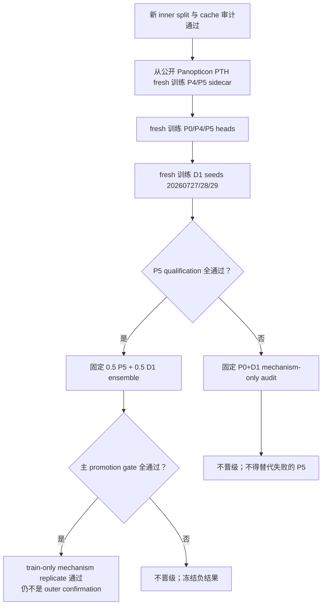

# L89 train-only clean inner replicate：严格训练与晋级协议

日期：2026-07-28 UTC  
Protocol ID：`l89-clean-train-only-replicate-v1`  
状态：**协议锁定；尚未启动 formal feature extraction 或 GPU 训练**

## 0. 这个实验能回答什么，不能回答什么

本实验用一份 source-training CSV 重新构造 event-disjoint inner train/dev，
从公开 Panopticon PTH 开始，完整重训：

1. response-scrambled P4 与 correct-response P5 synthetic sidecar；
2. P0/P4/P5 三个新的 downstream heads；
3. 三个新的 P0-conditioned D1 transient heads；
4. 固定 `0.5 P5 + 0.5 D1-ensemble` late-logit fusion。

它要回答：

> 在不复用任何旧 sidecar、分类 head、D1 checkpoint、epoch、threshold 或
> fusion calibration 的条件下，P5+D1 的互补信号能否在另一个
> event-disjoint train-only inner split 上复现？

它只能称为：

> **independent train-only inner replicate**

不能称为：

- outer evaluation；
- locked test；
- confirmatory test；
- independent source cohort；
- SOTA 结果。

原因是 inner train 和 inner dev 都来自同一份 source-training payload；虽然
本次内部 canonical-event overlap 为 0，但这不是一份从未参与研究过程的外层
数据。旧实验还已经影响了当前架构与 gate 的设计。

本协议不授权读取、列目录、stat 或运行任何外层、sealed 或 held-out payload。

## 1. 数据与 split lock

### 1.1 唯一允许的数据入口

Source-training CSV：

```text
/home/yuyao/panopticon/Upgraded_dataset/
  l89_6time_full_event_balanced_split/
  L89_temporal_train_full_event_balanced.csv
```

SHA-256：

```text
cb3d8720ee1dd94dc007a13be79786e8403878def12eb91da8398ca42864a798
```

Source summary：

| 项目 | 值 |
|---|---:|
| rows | 23,359 |
| canonical events | 848 |
| negative rows | 12,898 |
| positive rows | 10,461 |
| time range | 2016-09-16 至 2025-08-05 UTC |

canonical event 固定定义为：

```text
event_group_id = plume_id 去掉最后一个 "-suffix"
```

不得在看到新 dev 指标后改变 canonicalization、去重规则或 event grouping。

### 1.2 固定 inner split

固定策略：

```text
按 canonical event 的最晚 event_time 排序，
从最新 event 开始完整取入 dev，
直到达到 source rows 的 20%；
一个 event 不得跨 train/dev。
```

已生成的唯一合法 manifests：

| split | rows | events | label 0 | label 1 | SHA-256 |
|---|---:|---:|---:|---:|---|
| inner train | 18,682 | 672 | 10,237 | 8,445 | `8cee38e78f0ff7ebf5e34c02ba07d351cbf93438d9a78e88ad741dc8be3a22eb` |
| inner dev | 4,677 | 176 | 2,661 | 2,016 | `8caa5f7a31340c5007ec4457fd5766179a23dc1e97b432322768a8cef0144883` |

路径：

```text
research/tempo_20260728/l89_clean_inner_v1/train.csv
research/tempo_20260728/l89_clean_inner_v1/dev.csv
```

审计 receipt：

```text
research/tempo_20260728/l89_clean_inner_v1/READINESS_AUDIT.json
SHA-256 da54079d348d3d9cf13d3609a61e6315169e75d8b8ee977caa8143901c7c69df
```

以上三个 SHA 是 executable hard lock，不只是文档记录。formal launcher 在
创建 formal output root 前逐个重算并核验；resolver 再独立核验，并在
`manifests/AUDIT.json.frozen_split_lock` 中记录 observed/expected SHA 和
`exact_sha_match=true`。任一 payload 不同（即使 row/event 数相同）都必须
在解析图片路径和写 formal manifest 前失败。

硬条件：

- inner train/dev canonical-event overlap 必须等于 `0`；
- ordered ID、label、plume ID、event ID 在 manifest、cache 和 prediction
  table 之间必须一致；
- 不得删除难 event、难 row、all-negative event 或缺历史 row；
- 不得按旧模型或新模型错误筛选训练/开发样本；
- 不得根据 label 或 dev performance 改 crop、validity 或 duplicate mask。

### 1.3 READINESS 快照与当前 full-local launch gate

冻结的 `READINESS_AUDIT.json` 记录的是数据准备前快照，其中六 role
本地完整覆盖为 `10,122/23,359 = 43.332%`、`ready_to_launch=false`。
它用于锁定 split 身份和记录当时状态，不能被解释为当前 coverage receipt。
formal launch 是否可开始只由同一 split 上重新执行的 strict resolver 决定。

feature extraction 前必须满足：

- `t0` 本地可读率 `100%`；
- 六 role row-complete 率 `100%`；
- 对确实不存在的 source file，只能在预先审计后写成 unavailable mask，
  不得静默丢 row；
- train/dev 必须使用同一个冻结 extractor、相同 normalization 和 role
  schema；
- cache 写入后再次证明 event overlap 为 0。

full-local staging completion receipt 固定为：

```text
/diniuvol/yuyao/methanefuse_research_20260728/l89_clean_full_local_v1/STAGING_COMPLETE.json
SHA-256 3e11d6795c7da28a2c379e51dd993c049e6bb9af37e79b45aae1d9140a68bfec
verified_complete_files 79,401 / 79,401; errors 0
```

launcher 在 formal root 创建前核验该 exact SHA，并将 receipt 放入
`INPUT_SHA256SUMS.txt` 与最终 `RUN_COMPLETE.json` provenance。

本协议本身不执行 staging、remote I/O 或 GPU extraction。

## 2. 旧模型参数一律禁止复用

### 2.1 唯一允许加载的模型权重

只允许加载公开冻结 Panopticon 初始化：

```text
weights/panopticon_vitb14_teacher.pth
SHA-256 55024f411a7f383ed1a646d9b833b65683a4443846603fc7d37591d5afe9d26e
```

允许复用代码、公式和本协议锁定的 hyperparameters；不允许复用由旧数据
训练得到的任何参数。

### 2.2 明确禁止的对象

下列所有旧对象，无论指标多高，都不得成为新 run 的输入：

- 旧 P4/P5 synthetic sidecar；
- 旧 disposable synthetic probe；
- 旧 P0/P4/P5 downstream head；
- 旧 role-only / TransientQuery head；
- 旧 D1 seed `20260727/20260728/20260729` checkpoint；
- 旧 D3/D6/D7/patch checkpoint；
- legacy360/MethaneFuse classifier 或 router checkpoint；
- 旧 optimizer、scheduler、EMA、threshold、selected epoch；
- 旧 P5+D1 prediction ensemble；
- 任何“从旧 checkpoint 继续训练”或“只重置最后一层”的 warm start。

特别禁止从以下旧 run families 加载模型状态：

```text
rctp_l89_sidecar_fallback_v1/**
l89_global_v1/**
rctp_l89_patch_local_followup_v1/**
```

这些旧目录中的代码配置和文字报告可以只读用于审计，但其中 `.pt/.pth`、
optimizer state、prediction table 和 selected threshold 都不能进入新训练
或新 prediction 计算。

### 2.3 为什么旧 P0 也不能复用

旧 P0/P4/P5 和旧 D1 的训练谱系与新的 inner dev 发生交叉。即使旧 P0
没有 response sidecar，它的 downstream head 也已经在新 dev 的一部分事件上
训练过。因此：

- 不能把旧 P0 当新 baseline；
- 不能用旧 P0 作为 D1 frozen base；
- 不能用旧 P5 与新 D1 混合；
- 不能把旧 prediction 当 calibration input。

新 P0、P4、P5 heads 必须都只用新的 672-event inner train 训练。

### 2.4 必须实现的加载审计

新 launcher 在第一次 `torch.load` model payload 前必须生成
`MODEL_LOAD_LEDGER.json`：

```text
loaded external model artifacts:
  - public Panopticon PTH only

loaded current-run artifacts:
  - newly trained P4/P5 sidecars
  - newly trained P0/P4/P5 heads
  - newly trained D1 checkpoints
```

preflight 必须：

1. 拒绝任何模型路径落在旧 run family；
2. 拒绝 `resume` 或 optimizer-state load；
3. 检查公开 PTH SHA 精确等于本协议值；
4. 检查 P4/P5 sidecar fresh initial states 相同；
5. 检查 P0/P4/P5 head fresh initial states 相同；
6. 检查所有 current-run parent SHA 均指向本次 run namespace；
7. 检查没有旧 checkpoint SHA 出现在 dependency closure；
8. 将 runner、protocol、manifests 和 config 的 SHA 写入 receipt。

旧 frozen CLS cache 不得直接作为新模型输入。新的六时刻 cache 必须从本协议
manifest 和公开 PTH 重新产生；旧 CLS 最多只能用于 byte-level extractor
regression test，不能提供 row、label、feature 或 mask。

## 3. 固定模型与训练顺序

整个 replicate 的顺序固定如下。后一步只能读取前一步在**当前 run**产生的
artifact。

```text
public frozen Panopticon PTH
        │
        ├── fresh P4 scrambled-response synthetic sidecar
        ├── fresh P5 correct-response synthetic sidecar
        │
        ├── fresh P0 head on [base, exact-zero]
        ├── fresh P4 head on [base, 0.1 × P4 residual]
        └── fresh P5 head on [base, 0.1 × P5 residual]
                         │
fresh P0 head ───────────┴── fresh D1 seeds 20260727/28/29
                                  │
                        fixed mean-seed D1 logit
                                  │
fresh P5 logit ─── fixed 0.5/0.5 late fusion
```

### Stage A：重新提取 frozen per-visit base

- Panopticon 全冻结、`eval()`、`requires_grad=False`；
- 每行固定六个 role：
  `t0/prev1/prev2/prev3/seasonal/year`；
- base CLS：
  \([N,6,768]\)；
- 同时保存 valid mask、unique mask、真实 `delta_days`、valid fraction；
- duplicate visit 必须在 unique mask 中关闭；
- train/dev 各只提取一次，之后 head experiments 只读本地 cache。
- formal extraction 固定为每进程 batch `64`、workers `6`、
  prefetch factor `1`，train/dev 两进程在 physical GPU0 并发；
- GPU1 不暴露给 formal child；GPU0 或 host 的启动资源门不满足时
  fail-closed，不动态换卡或改变 batch；
- 双 extractor 实测峰值为 `44,671 MiB`。初始 preflight 与紧邻
  train/dev concurrent base pair 的第二次 preflight 都要求 GPU0 至少
  `53,248 MiB` free，即实测峰值加 `8,577 MiB` safety margin；host
  `MemAvailable` 同时至少 `40 GiB`；
- 启动前必须重放
  `l89_clean_e2e_smoke3072_v1.json` 所绑定的 3,072×2 cache receipt：
  `[N,6,768]`、event overlap `0`、read errors `0`、invalid-t0 `0`，
  并逐项核对 cache/CSV/public-PTH SHA。

cache producer 必须记录：

- source manifest SHA；
- public PTH SHA；
- ordered ID/event/label digest；
- feature/mask/gap/quality digest；
- per-role availability；
- extractor source SHA；
- `external_or_held_out_access=false`。

### Stage B：fresh P4/P5 synthetic sidecar

架构固定为 Sidecar-RCTP v2：

- Panopticon base byte-identical 且完全冻结；
- 三个 bias-free matrices：
  `768→8`、`response_metadata→8`、`8→768`；
- transferable sidecar 参数数固定 `12,416`；
- 最后一个 up-projection 初始化为 exact zero；
- disposable synthetic probe 只能看**未缩放 sidecar residual**，不能看到
  `z_base`；
- downstream 表示固定为
  `[z_base, 0.1 × residual]`；
- clean anchor 固定为
  `0.10 × mean(residual(clean)^2)`。

P4 与 P5 必须共享：

- synthetic seed `20260728`；
- sidecar/probe initial-state digest；
- inner-train background rows；
- batch order、plume field、mask、strength、injected visit；
- nuisance negatives、optimizer、LR、updates 和 precision；
- synthetic capability panel。

唯一允许差异：

```text
P4: fixed deterministic wavelength-response scramble
P5: correct L89 response ordering and metadata
```

所有 synthetic background 和 capability rows 只能来自新的 inner train。
inner dev 的真实或 synthetic image、feature、label 均不得参与 sidecar
pretraining或 checkpoint selection。

固定预算：

- 2 epochs；
- 每 epoch 2,048 inner-train negative references；
- 总计 1,024 optimizer updates；
- deterministic 512-row inner-train synthetic capability panel；
- capability panel 从 synthetic update stream 排除；
- P4/P5 各自按 panel AP 选 epoch；tie 取更早 epoch；
- 不允许增加 epoch、改变 rank、scale 或 anchor。

如果任一 arm 出现 non-finite loss、zero-sidecar shortcut contract 破坏、
base feature drift 或 identity mismatch，则**整对 P4/P5 无效**，不得只重跑
失败的一边并保留另一边。

### Stage C：fresh P0/P4/P5 downstream heads

三个 head 的结构、初始化、batch order 和优化器必须相同：

- input width `1536`；
- model width `256`；
- heads `8`；
- two current-query blocks；
- MLP ratio `2.0`；
- dropout `0.1`；
- train seed `20260728`；
- batch size `256`；
- evaluation batch size `512`；
- AdamW learning rate `3e-4`；
- loss 为 inverse-canonical-event-size BCE，并做 class-mass balance；
- checkpoint primary 为 inner-dev event-balanced row AP；
- threshold 为 inner-dev event-balanced row macro-F1 maximizer。

输入固定为：

\[
P0_t=[z^{base}_t,\mathbf{0}_{768}],
\]

\[
P4_t=[z^{base}_t,0.1r^{P4}_t],
\qquad
P5_t=[z^{base}_t,0.1r^{P5}_t].
\]

head 仍然使用 `t0` query 和 all-valid-role key/value。这个 head 不是本次
novelty，也不得给 P5 单独使用更强 readout。三个 arm 都固定
`enable_delta=false`；真实 acquisition gap 只进入后续 D1 gate，不能让
P4/P5 head 获得不同的时间输入。

三 arm 使用相同 fresh head initial-state digest。禁止把 P0 训练完的 head
复制给 P4/P5 微调；三个 arm 必须从同一个**未训练初始状态**独立开始。

### Stage D：fresh D1 seeds

D1 必须建立在**本次新训练并冻结的 P0 head**上，不能建立在 P5、旧 P0 或
zero-logit base 上。

固定 architecture：

\[
z_t=W_z\operatorname{LN}(x_t),\quad z_t\in\mathbb{R}^{192},
\]

\[
d_h=\operatorname{MLP}
\left([z_0-z_h,\ |z_0-z_h|]\right),
\]

\[
\alpha_h=\operatorname{MaskedSoftmax}
\left(
g(role_h,\Delta days_h,quality_h,
\cos(z_0,z_h),\|z_0-z_h\|_2)
\right),
\]

\[
\ell_{D1}=\ell_{P0}+
W_r\operatorname{LN}\left(\sum_h\alpha_hd_h\right).
\]

固定配置：

| 项目 | 值 |
|---|---|
| seeds | `20260727, 20260728, 20260729` |
| temporal width | `192` |
| dropout | `0.15` |
| gap periods | `1,3,7,30,90,365` days |
| batch size | `512` |
| eval batch size | `1024` |
| learning rate | `8e-4` |
| weight decay | `0.02` |
| gradient clip | `1.0` |
| loss | event-balanced BCE |
| max epochs | `4` |
| AP patience | `1` |

residual final layer必须 exact zero initialization，所以 epoch 0 必须数值回放
本次 frozen P0。三个 seed 都要保留；不得只汇报或融合最好 seed。

### Stage E：唯一允许的 fusion

D1 三 seed 先做 fixed mean-logit ensemble：

\[
\ell_{\overline{D1}}
=
\frac{1}{3}
\sum_{k\in\{20260727,20260728,20260729\}}
\ell_{D1,k}.
\]

主 candidate 固定为：

\[
\boxed{
\ell_{P5+D1}
=
0.5\ell_{P5}
+
0.5\ell_{\overline{D1}}
}.
\]

明确禁止：

- 搜索 `0.1/0.2/...` fusion weight；
- 根据 seed 表现改变 seed weight；
- learned liaison、logistic calibrator 或 reliability gate；
- D7、patch 或其他第三 expert；
- 在看到 dev 结果后增加 seed；
- 用 P5 threshold 或 D1 threshold 代替 candidate 自己的标准 metric
  threshold。

## 4. Early stopping 与 selection lock

### 4.1 P4/P5 synthetic

- 固定最多 2 epochs / 1,024 updates，不允许延长；
- non-finite、identity drift、shortcut-contract failure 立即停止整对实验；
- 正常情况下两 epoch 均运行，分别按固定 inner-train capability panel AP
  选 checkpoint；
- panel tie 取更早 epoch。

### 4.2 P0/P4/P5 heads

为保证结果链与 runner 完全一致并维持严格 matched compute：

1. epoch 1、2、3 对三个 arm 都固定运行；
2. epoch 3 后无条件停止，不实施逐 arm 或同步 early-stop；
3. 每个 arm 在这三个固定 epochs 中按 event-balanced row AP 选
   checkpoint，tie 取更早 epoch；
4. 三个 arm 必须使用同一初始化、epoch 数、batch plan、optimizer 和
   update budget。

不得对 P5 单独多跑 epoch。不得因为某 arm 的 macro-F1 较好而覆盖
AP checkpoint selection。

### 4.3 D1

- epoch 0 必须先验证 exact P0 replay；
- max 4 trained epochs；
- selection primary 为 event-balanced row AP；
- patience `1`：第一次 AP 未严格超过历史 best 即停止；
- tie 取更早 epoch；
- 非 finite、epoch-0 mismatch 或身份 mismatch 立即判该 seed 无效；
- 无效 seed 只能用同一 seed 和完全相同 config 从 fresh initialization
  重跑，不能替换 seed。

所有 early-stop decisions、observed epochs 和 selected epoch 必须写入
machine-readable receipt。

## 5. 指标定义

### 5.1 Event-balanced row metrics

对于 canonical event \(g\) 中的 \(n_g\) 行，每行权重：

\[
w_i=\frac{1}{n_g}.
\]

因此每个 event 的总 row weight 相同。必须报告：

- event-balanced row AP；
- event-balanced row AUC；
- event-balanced row macro-F1；
- event-balanced row positive-F1；
- selected threshold；
- F1@0.5；
- ordinary unweighted row metrics，作为 secondary diagnostic。

不能把它称作“one prediction per event”。模型仍对每一行预测，只是 metric
给每个 canonical event 相同总权重。

### 5.2 Threshold

每个完整 prediction system 只允许一个标准 threshold：

```text
在本次 inner dev 上最大化 event-balanced row macro-F1；
若多个 threshold 相同，使用 metric implementation 的确定性 tie rule。
```

P0、P4、P5、每个 D1、D1 ensemble、P0+D1 和 P5+D1 分别计算自己的
standard threshold。不得做 threshold × fusion-weight 组合搜索。

### 5.3 All-negative-event FP mass

对 inner dev 中所有 label 最大值为 0 的 canonical event：

1. 在该 model 的已锁 standard threshold 上计算 event 内 hard-FP row rate；
2. 对 all-negative events 求和。

\[
FPmass=\sum_{g:\max(y_g)=0}
\frac{\#FP_g}{n_g}.
\]

每个 all-negative event 的最大贡献为 1。必须同时报告 hard-FP event count
和 hard-FP row count。

### 5.4 Canonical-event clustered bootstrap

固定：

- paired resampling unit：canonical event；
- replicates：`5,000`；
- seed：`2026072808`；
- 每个 replicate 从 176 个 dev events 有放回采样 176 次；
- 一个 event 被抽中 \(k\) 次时，该 event 所有 rows 共同获得 multiplicity
  \(k\)，event 内 row 仍均分权重；
- model checkpoint、fusion weights 和 point threshold 全部固定；
- bootstrap 内不重新选择 epoch、seed、weight 或 threshold。

对每个 comparison 报告 point delta、95% percentile CI 和 win probability：

- AP；
- AUC；
- macro-F1；
- positive-F1；
- FP mass（lower is better）。

## 6. P5 资格门

主 P5+D1 candidate 只有在新的 P5 本身先成为合格 response/appearance
expert 时才有 promotion 资格。

定义：

```text
P5_qualified =
    synthetic_AP(P5) > synthetic_AP(P4)
and real_AP(P5)      > max(real_AP(P0), real_AP(P4))
and real_AUC(P5)     > max(real_AUC(P0), real_AUC(P4))
and real_macro(P5) - max(real_macro(P0), real_macro(P4)) >= -0.003
and FPmass(P5) - FPmass(P0) <= +0.5
```

这里的 synthetic AP 只来自固定 inner-train capability panel，real metrics
只来自新的 inner dev。

任一条件失败即写：

```text
P5_qualified = false
P5+D1 promotion_eligible = false
```

不能通过忽略 P4、换 synthetic metric、只看 AP、放宽 FP gate 或重新训练
P5 来挽救。

资格门不能直接信任 `comparison.json` 中的数值。promotion audit 必须独立
加载 P0、P4、P5 三份 prediction CSV，以 ordered
`id/plume_id/event_id/label` 严格对齐，重算每个 arm 的 AP/AUC/macro-F1、
positive-F1、threshold 和 FPmass，并记录每份 prediction 的 SHA；重算值
还必须与 `comparison.json` 逐项一致，任何缺列、错序、identity/label
不一致、SHA 或 metric 不一致都 fail-closed。

## 7. 主 promotion gate

只有 `P5_qualified=true` 时才评估晋级资格。reference 为本次新 P5，
candidate 为固定 P5+D1：

\[
\Delta m=m(P5+D1)-m(P5).
\]

主 gate 是以下条件的**逻辑与**：

```text
AP point delta                  >  0
AUC point delta                 >  0
AP cluster-bootstrap 95% lower >  0
macro-F1 point delta            >= -0.003
FPmass point delta              <= +0.5
```

machine-readable 等价形式：

```json
{
  "reference": "new_p5",
  "candidate": "fixed_0.5_p5_plus_0.5_d1_three_seed_logit_ensemble",
  "requirements": {
    "event_balanced_row_ap_point_delta": "> 0",
    "event_balanced_row_auc_point_delta": "> 0",
    "ap_cluster_bootstrap_ci95_low": "> 0",
    "event_balanced_row_macro_f1_point_delta": ">= -0.003",
    "all_negative_event_fp_mass_point_delta": "<= 0.5"
  },
  "all_conditions_required": true
}
```

任何一条失败：

- `promotion=false`；
- 不运行新的 weight/threshold/head search；
- 不增加 epoch 或 seed；
- 不触发任何外层 evaluation；
- 只报告本次 train-only replicate 的正负结果。

即使全部通过，也只能写：

> mechanism replicated on a second event-disjoint inner split derived from
> the same source-training cohort.

它仍不是 outer confirmation。

## 8. P5 失败时的 P0+D1 fallback

无论 `P5_qualified` 为真或假，promotion audit 都必须在作出分支决定前读取
三个固定 seed 的 `summary.json`，逐 seed 验证：

- seed 精确为 `20260727/20260728/20260729`，无缺失或重复；
- epoch 0 exact P0 replay 通过，parent P0 checkpoint path、file SHA 与
  model-state SHA 精确指向本次 fresh P0；
- 三个 seed 各自的 `p0_base_predictions.csv` 与 fresh matched-head P0
  CSV 必须独立逐行比较，`max_abs_probability_error <= 1e-6`；identity/label
  相等或 summary boolean 不能替代该数值检查，三份 path/SHA/error 都写入
  promotion receipt；
- deterministic cross-event donor-pairing shuffle receipt 存在，
  identity/label/shape 有效且所有指标 finite；
- trained history、selected epoch、patience 与 early-stop receipt 自洽，
  不得超出 4 epochs 或更改 patience `1`。

因此 P5-qualified 主分支不能绕过 D1 lineage/validity 审计。

如果 `P5_qualified=false`，三 seed D1 仍按本协议完成，因为它可以独立回答
“acquisition-aware transient 是否在新 split 上使用历史并补充 P0”。

固定 fallback：

\[
\ell_{P0+D1}
=
0.5\ell_{P0}
+
0.5\ell_{\overline{D1}}.
\]

必须报告：

- P0、D1 三 seed、D1 mean-logit ensemble、P0+D1；
- P0+D1 相对 P0 的五项 point delta 和 5,000-replicate clustered
  bootstrap；
- 每个 D1 seed 的 deterministic cross-event donor-pairing history shuffle；
- shuffle 前后 AP/AUC/macro-F1/positive-F1/FPmass；
- epoch-0 exact P0 replay。

但是状态必须固定为：

```text
audit_type = P0+D1 mechanism-only fallback
promotion_eligible = false
outer_evaluation_eligible = false
```

即使 P0+D1 数值很好，也不能替代失败的 P5 response expert，更不能改称
完整 TEMPO winner。

## 9. Formal mechanism diagnostics 与明确排除项

本次 formal replicate 只锁定以下两个 diagnostics，均不参与模型选择：

1. **deterministic cross-event donor-pairing history shuffle**  
   保留 t0、label、row identity、availability pattern 和 acquisition
   metadata，只将五个 history features 换成 deterministic、seeded、来自
   不同 canonical event 的 donor。donor 必须在完整五-history
   `(valid_mask, unique_mask)` exact-pattern stratum 内配对，因此
   donor/target availability mismatch 必须为 `0`；gap 与 quality 不参与
   donor matching，并继续保留 target row 的值。任一 pattern 没有跨 event
   donor 时整个 audit fail-closed。每个 D1 seed 单独报告 donor-index SHA、
   pattern counts、mismatch count 与 validity receipt。

2. **all-negative events**  
   报告 FPmass、any-FP event count 和 hard-FP rows；不得根据具体 event
   再添加 loss。

history shuffle 若没有使 D1 AP/AUC 下降，应如实写“没有验证 history
mechanism”；它不是主 promotion gate 的替代品。

早期协议草案列出的 **missing-role strata** 与 **gap strata** 在 formal
启动前经独立审计后从本次锁定范围删除：现有 promotion input 没有一份独立
冻结、可按 prediction identity 对齐并重算这两个 strata 的 role/gap table。
本次 run 不得静默生成、事后补做或宣称这两个 diagnostics；若未来需要，
必须另立 protocol/run namespace，预先冻结 strata 定义与输入 SHA。该删除
不改变模型、训练、P5 qualification 或 promotion gate。

## 10. 必须保存的 artifacts

launcher 实际保存的最小等价 artifacts 为：

```text
provenance/SOURCE_SHA256SUMS.txt
provenance/INPUT_SHA256SUMS.txt
provenance/SMOKE3072_PREREQUISITE_AUDIT.json
MODEL_LOAD_LEDGER.json
MODEL_LOAD_LEDGER_FINAL.json
manifests/AUDIT.json
sidecar_split/AUDIT.json
sidecar/pretrain/p4/summary.json
sidecar/pretrain/p5/summary.json
event_balanced_heads_seed20260728/comparison.json
event_balanced_heads_seed20260728/p0/validation_best_event_balanced_ap_predictions.csv
event_balanced_heads_seed20260728/p4/validation_best_event_balanced_ap_predictions.csv
event_balanced_heads_seed20260728/p5/validation_best_event_balanced_ap_predictions.csv
tempo_d1_three_seed/aggregate.json
tempo_d1_three_seed/seed_{20260727,20260728,20260729}/p0_base_predictions.csv
tempo_d1_three_seed/seed_{20260727,20260728,20260729}/summary.json
tempo_d1_three_seed/seed_{20260727,20260728,20260729}/d1_gated_delta_metrics_history.json
audits/fixed_p5_mean_d1/RESULT.json
audits/promotion_chain/RESULT.json
audits/promotion_chain/PROMOTION_DECISION.json
ARTIFACT_SHA256SUMS.txt
RUN_COMPLETE.json
```

`audits/promotion_chain/PROMOTION_DECISION.json` 必须至少包含：

- protocol ID 与 SHA；
- source/train/dev manifest SHA；
- event overlap；
- public PTH SHA；
- 所有 initialization、checkpoint 和 prediction SHA；
- P5 qualification 每一条件的 observed value 和 pass/fail；
- 主 promotion 每一条件的 observed value 和 pass/fail；
- fallback 是否被触发；
- early-stop epochs；
- `old_checkpoint_reused=false`；
- `external_or_held_out_access=false`；
- final decision 和 claim boundary。

## 11. Fail-closed launch checklist

只有全部为真才允许未来另行启动：

- [ ] source/train/dev SHA 与本协议一致；
- [ ] inner train/dev/READINESS exact SHA 分别为
      `8cee38e7…a22eb`、`8caa5f7a…4883`、`da54079d…c69df`，且 resolver
      audit 的 frozen split lock 全部通过；
- [ ] train/dev canonical-event overlap 为 0；
- [ ] 六 role local coverage 达到本协议要求；
- [ ] public Panopticon PTH SHA 一致；
- [ ] model load ledger 中没有任何旧 checkpoint；
- [ ] fresh P4/P5 initial states matched；
- [ ] fresh P0/P4/P5 head initial states matched；
- [ ] D1 seeds 精确为 `20260727/28/29`；
- [ ] fixed fusion 精确为 `0.5/0.5`；
- [ ] 代码与 protocol snapshot 已写入新 run namespace；
- [ ] 所有输入路径通过 held-out-marker fail-closed guard；
- [ ] GPU0 两次 preflight 均达到 `53,248 MiB` free，且第二次紧邻
      concurrent base pair；
- [ ] 没有 staging、GPU 或外层访问被本协议文档隐式授权。

任一项失败都必须停止，不得降级为旧 checkpoint warm start。

## 12. 最终决策树



无论走哪条路径，本协议都不允许自动打开任何外层数据，也不允许把这个
train-only replicate 写成 SOTA。
