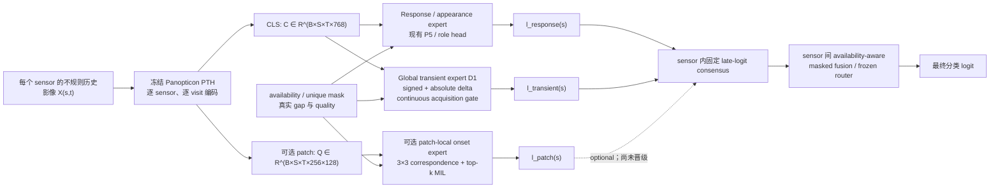

# TEMPO 技术架构说明：它到底是什么、张量怎样流

日期：2026-07-28 UTC  
状态：开发集实验总结；没有读取或报告新的 `test/sealed/holdout` 结果

## 0. 先直接回答架构问题

这套方法不是“把 `t0` 当 query、其他时刻当 key/value”的另一种
cross-attention。已有 MethaneFuse / role-only head 本来就做
`t0-query / all-valid-role-KV` cross-attention。

当前实验真正支持的结构是：

1. **先冻结已有 Panopticon PTH**，不再靠当前数据训练大型预训练模型；
2. **在每个 sensor 内把两种证据拆开**：
   - response / appearance expert：保留原模型已经学到的甲烷响应和场景外观；
   - transient expert：显式计算 `t0-history` 的有符号变化和变化幅度；
3. transient expert 不把六个时刻当等间隔视频帧，而用真实时间差、角色、
   质量和相似度决定每个历史观测的权重；
4. 两个 expert 分开训练，最后才做**固定 logit 融合**；
5. 多 sensor 时，先在各 sensor 内形成证据，再按 availability mask 融合或
   路由，而不是把不同 sensor 的原始像素或 token 提前混在一起。

一句技术概括是：

> **Frozen response/appearance pathway + independently trained
> acquisition-aware transient pathway + fixed late evidence consensus.**

这里必须区分“最终接口”和“已完成验证”：

- L89 已验证的是 `1 sensor × 6 visits` 的 response/transient 两流；
- legacy360 已验证的是 `4 sensors × 3 roles` 的 sensor-native evidence
  和 availability router；
- **尚未完成**一个共同裁剪、共同事件切分下的
  `4 sensors × 6 visits` 端到端联合实验。因此不能把下面的可组合接口
  描述成已证明的统一四传感器模型。

## 1. 总体数据流



符号：

- \(B\)：batch size；
- \(S\)：sensor 数，目标接口最多为 4；
- \(T=6\)：`t0/prev1/prev2/prev3/seasonal/year`；
- \(D=768\)：冻结 Panopticon CLS 维度；
- \(P=16\times16=256\)：可选 patch 数；
- \(d=192\)：L89 D1 transient hidden width；
- \(m_{s,t}\in\{0,1\}\)：观测既有效又非重复时为 1；
- \(\Delta_{s,t}\)：该观测相对 `t0` 的真实时间差；
- \(q_{s,t}\)：有效像素比例等 acquisition quality。

目标统一接口可写成：

\[
C\in\mathbb{R}^{B\times S\times6\times768},\quad
M,\Delta,Q\in\mathbb{R}^{B\times S\times6}.
\]

当前 L89 实验取 \(S=1\)，所以实际输入是
\([B,6,768]\)。legacy360 的现有缓存则是
\([B,4,3,768]\)，不能假装成同一个六时刻实验。

### 1.1 论文真正要解决的技术问题：doubly partial observations

上一篇 MethaneFuse 只显式处理第一层 partiality：

\[
\text{sensor partiality}:\quad
\exists s,\;m_{s,0}=0.
\]

六时刻数据又增加第二层：

\[
\text{history partiality}:\quad
\exists(s,t),\;m_{s,t}=0
\quad\text{or}\quad
a_{s,t}=a_{s,t'},
\]

其中 \(a\) 是 acquisition ID；后一种情况表示两个 nominal role 实际是
同一景，不能当两份证据。技术 gap 不是“缺一个更复杂 attention”，而是
现有三类结构各自只处理一半问题：

- 普通 EO FM / 单时刻 classifier 学 appearance，不显式分离 transient；
- 普通视频模型假设近似规则帧率和同质 camera，不适合真实 EO gap；
- MethaneFuse 处理 sensor 缺失，但旧三时刻沿 channel 拼接，没有真实
  `delta_t` 和 duplicate-aware temporal evidence。

TEMPO 的核心结构假设是：

\[
\boxed{
\text{先在每个 sensor 内形成可靠的 time evidence，}
\quad
\text{再在 sensor 之间处理 availability}
}
\]

即：

\[
(X_{s,0:5},M_{s,0:5},\Delta_{s,0:5},Q_{s,0:5})
\xrightarrow{\text{appearance/transient experts}}
e_s
\xrightarrow{\text{sensor availability router}}
\ell.
\]

这也是从视频和 NormWear 各借什么、拒绝什么的统一解释：

- 从视频借 `appearance/change` 两流分工，不借固定帧率和 optical flow；
- 从 NormWear 借“异质 channel 先独立形成 evidence”，不借大预训练和
  learned liaison；
- 多 sensor 融合发生在 compact evidence/logit 层，不把异质 sensor 的
  raw token 当同一种视频帧。

## 2. Sensor 内：response / appearance expert

### 2.1 P5 的输入和作用

L89 P5 cache 对每个 visit 保存：

\[
c^{P5}_{t}
=
\left[
c^{base}_{t},\
0.1\,r^{sidecar}_{t}
\right]
\in\mathbb{R}^{1536},
\]

其中 \(c^{base}_{t}\in\mathbb{R}^{768}\) 是 byte-identical frozen
Panopticon CLS，\(r^{sidecar}_{t}\in\mathbb{R}^{768}\) 是小型
response-conditioned sidecar。六时刻张量为
\([B,6,1536]\)。

P5 head 先把六个 role token 投影到共同维度，再以 `t0` token 为 query，
所有有效 role token 为 key/value，连续做两层 current-query block：

\[
h_t=W_c c^{P5}_t+e^{role}_t,
\]

\[
u^{(0)}=h_0,\qquad
u^{(k+1)}
=
u^{(k)}
+
\operatorname{CrossAttn}
\left(
Q=u^{(k)},K=H,V=H;\ M
\right),
\]

\[
\ell_R=W_R\,\operatorname{LN}(u^{(2)}).
\]

因此，`t0` 当 query 不是新结构，也不是本文可主张的 novelty。

这个分支的功能是保留较强的响应/外观排序能力，而不是显式回答
“当前观测相对历史发生了什么”。“response expert”在这里是一个操作性名称：
P5 的真实 L89 AP 有正向信号，但原 response-specific synthetic
falsifier 没有通过，所以不能据此声称已经证明了因果的
sensor-response specificity。

### 2.2 P0 的角色

P0 使用相同 1536-D head 宽度，但输入是：

\[
c^{P0}_t=[c^{base}_t,\mathbf{0}_{768}].
\]

它提供不含 sidecar 的强冻结基线。D1 在 P0 上以零初始化 residual
开始训练，因此 epoch 0 与 P0 数值一致。

## 3. Sensor 内：global transient expert D1

### 3.1 显式差分，不是隐式 token mixing

输入为 frozen base CLS：

\[
X=[x_0,x_1,\ldots,x_5]\in\mathbb{R}^{B\times6\times768}.
\]

先做归一化和无 bias 投影：

\[
z_t=W_z\operatorname{LN}(x_t),\qquad
z_t\in\mathbb{R}^{B\times192}.
\]

对五个历史 role \(h\in\{1,\ldots,5\}\)，D1 **显式构造**：

\[
\delta_h=z_0-z_h,\qquad
a_h=|\delta_h|,
\]

\[
d_h=f_\Delta([\delta_h,a_h])
\in\mathbb{R}^{B\times192}.
\]

堆叠后：

\[
D=[d_1,\ldots,d_5]\in\mathbb{R}^{B\times5\times192}.
\]

这一步与普通 cross-attention 的核心差别是：模型不必自己从
`QK^T` 中“猜出”变化，而是把变化方向与幅度作为明确的输入变量。

### 3.2 Acquisition gate

每个历史观测都有一个 gate context：

\[
g_h=
\left[
e^{role}_h,\
e^{gap}(\Delta_h),\
q_h,\
\cos(z_0,z_h),\
\|z_0-z_h\|_2
\right].
\]

其中 role embedding 和 gap encoding 分别为
\([B,5,192]\)。连续 gap encoder 同时包含：

\[
\operatorname{sgn}(\Delta)\log(1+|\Delta|),\quad
\log(1+|\Delta|),
\]

以及周期 \(1,3,7,30,90,365\) 天的 Fourier
\(\sin/\cos\) 分量。它表达真实 acquisition lag，而不是把
`prev3`、`seasonal` 等角色当固定帧率。

gate 输出：

\[
\alpha_h=
\operatorname{MaskedSoftmax}_h
\left(
f_g(g_h);\ m_h
\right),\qquad
\alpha\in\mathbb{R}^{B\times5}.
\]

缺失或重复历史的权重严格为零。最后：

\[
v_T=\sum_{h=1}^{5}\alpha_h d_h
\in\mathbb{R}^{B\times192}.
\]

这里 gate 解决三个实际问题：

1. 六个 role 的真实时间差并不固定；
2. 某些历史缺失或只是重复文件；
3. 云、有效像素比例和场景差异会让同一 nominal role 的可靠性不同。

### 3.3 零初始化 residual 与最终 D1 logit

\[
r_T=W_2\,
\operatorname{GELU}
\left(
W_1\operatorname{LN}(v_T)
\right),
\]

其中最终 \(W_2\) 无 bias 且初始化为全零。因此：

\[
\ell_{D1}^{(epoch\,0)}=\ell_{P0},
\]

\[
\ell_{D1}=\ell_{P0}+r_T.
\]

如果一行没有任何有效历史，聚合向量和 residual 都被置零，模型自动回退
到 P0。

最关键的训练隔离是：D1 **不在 P5 上继续联合微调**。D1 只在 frozen
P0 周围学习 transient correction；训练完成后才与 frozen P5 融合：

\[
\boxed{
\ell_{L89}
=
0.5\,\ell_{P5}
+
0.5\left(
\frac{1}{K}\sum_{k=1}^{K}\ell_{D1,k}
\right)
},\qquad K=3.
\]

权重 0.5 是预先固定的，不在 development set 上搜索。

直接在 P5 上训练 D1 residual 已经失败：它很快贴回 P5 的原决策面，
history-shuffle 效应几乎消失。这个负结果说明当前增益来自
**独立错误的晚期共识**，而不是“在强 head 上再叠一层”。

## 4. 可选的 patch-local transient expert

CLS 会把只占少量区域的羽流稀释，因此另一个已实现但尚未晋级的分支读取：

\[
Z\in\mathbb{R}^{B\times6\times256\times128}.
\]

对当前 patch \(p\) 和历史 visit \(h\)，只在历史 3×3 邻域
\(\mathcal N(p)\) 内寻找软对应：

\[
\widetilde z_{h,p}
=
\sum_{q\in\mathcal N(p)}
\operatorname{softmax}_q
\left(
\frac{
(W_qz_{0,p})^\top(W_kz_{h,q})
}{\sqrt d}
\right)
W_vz_{h,q}.
\]

再构造 current-history change 与 history-history normality，并让小 MLP
学习 local onset。最高 10% patch 的 onset 经 MIL pooling 形成
\(\ell_P\)。最终 readout 同样是 zero-init residual。

它处理的是三个局部问题：

- plume 只占少量 patch；
- 小幅配准偏差不能用同坐标硬相减；
- 普通地表变化需要由 history-history variation 表达。

但是四 seed 的 patch readout 虽有互补信号，固定
`P5+D1+patch` 相对 `P5+D1` 的 AP 增量只有 `+0.000462`，bootstrap
区间跨 0。因此当前默认模型**不包含 patch**；只保留为 optional
component，不能作为已验证主贡献。

## 5. Sensor 轴：legacy 四传感器 evidence 与 router

### 5.1 当前真正训练过的张量

legacy360 输入为：

\[
X^{legacy}
\in
\mathbb{R}^{B\times4\times3\times768},
\]

其中四个 sensor 为 S2、L89、EMIT、S5P，三个 role 是当前、
short-history（约 90 天）和 long-history（约 360 天）。

先对**每一个 observation 自身**做 stateless LayerNorm。对 sensor \(s\)
和历史 role \(h\in\{short,long\}\)：

\[
\delta_{s,h}
=
\operatorname{LN}(x_{s,0})
-
\operatorname{LN}(x_{s,h}).
\]

R4 把当前 appearance、signed motion 和 motion magnitude 分开：

\[
A_{s,h}=f_A(x_{s,0}),\qquad
M_{s,h}=f_M(\delta_{s,h}),\qquad
U_{s,h}=f_U(|\delta_{s,h}|),
\]

\[
E_{s,h}
=
A_{s,h}\odot
\sigma\left(f_E([M_{s,h},U_{s,h}])\right)
+
M_{s,h}.
\]

张量形状为：

\[
E\in\mathbb{R}^{B\times4\times2\times d}.
\]

历史轴和 sensor 轴都使用 availability mask：

\[
\bar E_s
=
\operatorname{MaskedMean}_{h}(E_{s,h})
\in\mathbb{R}^{B\times4\times d},
\]

\[
E_{fused}
=
\operatorname{MaskedMean}_{s}(\bar E_s)
\in\mathbb{R}^{B\times d}.
\]

随后分别产生 bounded sensor residual 和 fused residual：

\[
\ell_s=\ell_s^{P0}
+
c\tanh(r_s/c),
\]

\[
\ell_{R4}=\ell_{fused}^{P0}
+
c\tanh(r_{fused}/c).
\]

分类器零初始化，所以 epoch 0 精确回放 frozen P0。

### 5.2 Frozen availability router

development audit 显示 R4 的收益主要来自“当前只有一个 sensor 可用”的
行。于是冻结了一个不学习参数的部署规则：

\[
\ell_{route}(i)=
\begin{cases}
\ell_{R4}(i), & \sum_s m_{i,s,0}=1,\\
\ell_{P0}(i), & \sum_s m_{i,s,0}\ne1.
\end{cases}
\]

两个分支保留各自已冻结的 threshold。这个 router 在 legacy360
development 上达到 binary F1 `0.910745`，但它是**历史协议下的工程证据**：
warm start 与开发选择并不满足新的 clean confirmatory 标准，不能把
`>0.90` 写成新方法 SOTA。

### 5.3 Transient 并不会自动解决 multi-sensor fusion

Transient expert 只解决 sensor 内的时间变化。不同 sensor 的波段、
单位、GSD、PSF、检索产品语义和 availability 不同，所以不能简单地令：

```text
t0 from sensor A = query
history from all sensors = shared key/value
```

当前支持的顺序是：

```text
sensor-native normalization
→ sensor 内 appearance/transient evidence
→ 缺失历史 mask
→ 每个 sensor 先形成 compact evidence/logit
→ 缺失 sensor mask
→ fixed consensus 或 frozen availability router
```

这就是 sensor 轴与 time 轴的职责分离。真正的四传感器六时刻模型还需要
从四个 sensor 的 512 图像重新做共同时间、地点、plume ID、FOV/crop 和
event split 后才能验证。

## 6. 训练分成哪些阶段

### Stage 0：冻结图像 backbone

- PTH：`weights/panopticon_vitb14_teacher.pth`；
- 逐 sensor、逐 visit 提取 CLS，必要时提取 patch token；
- backbone 全程 `requires_grad=False`、`eval()`；
- 缓存身份、event/plume ID、role、gap、quality、mask 和 SHA。

这一阶段不是新预训练。它把昂贵图像 I/O 与后续几秒级 head 实验分离。

### Stage 1：训练并冻结 appearance/response 基线

- P0/P5 head 只在 inner-train 训练；
- 使用 event-balanced BCE：同一 canonical event 的所有 row 总权重为 1；
- 只用 inner-dev 选择 checkpoint 和 threshold；
- 选好后冻结 PTH。

注意：这里的 event-balanced AP/F1 都是**event-balanced row metric**，
不是“每个 event 先压成一个 prediction”。只有 uncertainty 分析在
canonical-event 层做 paired cluster bootstrap。

### Stage 2：独立训练 D1 transient expert

- 从 exact frozen P0 logit 出发；
- 只训练 projection、delta encoder、acquisition gate 和 zero-init
  residual head；
- 相同 event-balanced BCE；
- 每个 seed 通常 2–3 epoch 即停止，AP 下降就 early stop；
- 三个预声明 seed，不挑最好 seed。

### Stage 3：固定 late fusion

- P5 和每个 D1 PTH 全部冻结；
- 对 D1 seeds 先做固定 mean-logit ensemble；
- 再做 `0.5 P5 + 0.5 D1`；
- 不训练 reliability gate，不搜索融合权重。

### Stage 4：可选 patch 与 outer protocol

- patch 分支从 frozen P0 独立训练；
- 只有预声明多 seed gate 通过才可加入 lock；本轮没有通过；
- exactly-once outer evaluator 和 cache producer 已完成开发模板，但没有
  final authorized lock，也没有执行新的 outer/test evaluation。

## 7. 哪些组件被结果支持

### 7.1 支持保留

1. **P5 与 D1 分开训练、固定晚融合。**  
   L89 三 seed logit ensemble 的 event-balanced row AP/AUC/positive-F1
   相对 P5 的 canonical-event paired bootstrap 95% 区间均高于 0；
   macro-F1 区间仍跨 0。

2. **D1 的历史信息是真的在被使用。**  
   跨 event history shuffle 后，D1 三 seed mean AP 降
   `0.014475`，macro-F1 降 `0.012268`。

3. **连续 acquisition gate 比硬 fast/slow 分箱更适合不规则 EO。**  
   参数、seed、batch、optimizer、loss 和训练时间匹配的
   SparseSlowFast D7 虽有强 history-shuffle 效应，但没有通过 AP gate。

4. **sensor-native appearance + motion 是可工作的 legacy 工程结构。**  
   R4 超过 frozen P0；收益主要集中在 one-sensor availability。

5. **固定简单融合比小数据上学习复杂 liaison 更稳。**  
   L89 OOF reliability liaison 和 legacy NormWear-style liaison 都没有
   超过各自简单固定融合。

6. **patch-local 分支包含互补信号，但尚不足以晋级。**

### 7.2 已被否决或当前证据不足

| 组件 | 结论 | 为什么不进入最终架构 |
|---|---|---|
| 大规模六时刻/多 sensor 预训练 | 放弃主线 | 数据量和资源不支持，已有短实验也未形成稳定优势 |
| 仅改变 t0-query cross-attention | 否决为 novelty | 旧 head 已经这样做；matched attention control 也不优于 R4 |
| hard global background subtraction | 否决 | 在 global CLS 上把弱甲烷证据和 nuisance 一起减掉 |
| D1 直接接在强 P5 上训练 | 否决 | AP 下降，history-shuffle 效应接近消失 |
| appearance-free D6 | 否决 | 真正使用历史，但 methane discrimination 太弱 |
| all-negative null loss | 否决 | 没提高 AP/F1，false-positive mass 更差 |
| learned reliability / fusion weight | 否决 | 五折 OOF 不优于 fixed equal fusion |
| NormWear-style learned liaison | 否决 | legacy R5 不优于 masked mean / fixed router |
| SparseSlowFast D7 | 正式否决 | macro-F1 较好，但 AP 未过预声明 gate，epoch 3 已明显过拟合 |
| patch 加入默认模型 | 暂不晋级 | 相对 P5+D1 增量小且 bootstrap CI 跨 0 |
| S5P approximate grid | 否决 | AUC 接近随机，不能作为统一六时刻证据 |
| S2 collapsed cache | blocked | `[N,1536]` 已把六时刻折叠，无法恢复 per-time delta |

## 8. 与四种相邻架构的精确区别

### 8.1 与上一篇 MethaneFuse 的区别

上一篇 MethaneFuse 解决的是：

```text
不同 sensor 经常缺失
→ sensor-native encoding
→ masked sensor-set fusion
→ 扩大可用事件覆盖并提升下游分类/分割
```

当前 TEMPO 要解决的是：

```text
同一 sensor 的六次观测稀疏、不规则、可能缺失/重复
且 plume 可能只在 t0 短暂出现
→ 保留已有 response/appearance expert
→ 独立显式建模 t0-history signed/magnitude change
→ 用真实 acquisition gap/quality 竞争历史证据
→ 仅在 decision level 做固定共识
```

所以差异不是“把上一篇 attention 换了一个写法”，而是：

- 上一篇的核心轴是 **sensor availability**；
- 当前新增的核心轴是 **sensor 内 irregular transient evidence**；
- 两者最终可以组成 time-axis expert + sensor-axis router，但统一实验尚未完成。

### 8.2 与普通 cross-attention 的区别

普通 cross-attention：

\[
\operatorname{softmax}(QK^\top/\sqrt d)V
\]

主要完成上下文 token 聚合。它没有强制产生：

- \(z_0-z_h\) 的有符号变化；
- \(|z_0-z_h|\) 的变化幅度；
- 真实时间差、质量与重复 mask 驱动的 acquisition competition；
- appearance expert 与 transient expert 的训练隔离；
- 固定 late decision consensus。

而且现有 P5/role-only head 已经是 `t0-Q / roles-KV`。因此 attention
只能作为 baseline，不是本方法定义。

### 8.3 与 SlowFast 的区别

SlowFast 的原始语义建立在稠密、近似稳定帧率视频上：

- slow pathway 低帧率、高通道，保留语义；
- fast pathway 高频率、低通道，捕获运动；
- 两路通过 lateral connections 交换特征。

TEMPO 只借用了“scene/appearance 与 change/transient 非对称分工”的
设计先验。它没有照搬：

- 稳定 frame rate；
- fast/slow 固定采样比例；
- video backbone；
- learned lateral connection。

我们还实际测试了最接近 SlowFast 的 D7：
`prev1/2/3 → fast`、`seasonal/year → slow`。它在相同计算量下没有过
AP gate。因此最终 D1 使用**单个连续时间差 gate**让所有有效历史按真实
lag 与 quality 竞争，不能把最终方法称作“新 SlowFast”。

### 8.4 与 NormWear 的区别

NormWear 的相关思想是：

- wearable channels 独立编码；
- CWT 等时频表示；
- 特殊 liaison/CLS token 周期性交换跨 channel 信息。

TEMPO 只保留“异质 axis 先独立形成 evidence，再晚沟通”的设计直觉。
最终结构不包含：

- CWT；
- 同步 wearable channel 假设；
- 大规模 masked pretraining；
- periodic CLS liaison；
- learned cross-sensor attention。

我们测试过 NormWear-style masked liaison，它没有超过 masked mean /
fixed router。因此最终采用固定 logits 和 availability mask，而不是
把 NormWear 改名搬过来。

## 9. 当前结果怎样读，不能怎样读

L89 当前 strongest global development result：

| 模型 | Event-balanced row AP | AUC | Macro-F1 | Positive-F1 |
|---|---:|---:|---:|---:|
| frozen P5 | 0.765148 | 0.848388 | 0.772047 | 0.713650 |
| fixed P5+D1 three-seed logit ensemble | **0.772943** | **0.853505** | **0.777219** | **0.724457** |

相对 P5 的 paired canonical-event-cluster bootstrap：

- AP `+0.007795`，95% CI `[+0.001459,+0.015550]`；
- AUC `+0.005117`，95% CI `[+0.000609,+0.009796]`；
- positive-F1 `+0.010807`，95% CI `[+0.001963,+0.020793]`；
- macro-F1 `+0.005172`，95% CI `[-0.001493,+0.012264]`。

正确结论是：

> 在当前复用的 L89 development protocol 上，独立 acquisition-aware
> transient evidence 对 response/appearance expert 提供了可测的互补
> ranking 和 positive-class signal；固定 late fusion 比直接 residual、
> hard SlowFast 分箱和 learned liaison 更稳定。

不能写成：

- 已达到跨 sensor SOTA；
- 已证明 response conditioning 的全新原理；
- 已完成统一四传感器六时刻模型；
- 已证明 macro-F1 的 confirmatory 提升；
- 已完成一次干净 locked outer test。

新的 fresh clean split 又给出一个更保守、但更可复现的读法：

| 模型 | Event-balanced AP | AUC | Macro-F1 | Positive-F1 |
|---|---:|---:|---:|---:|
| fresh P0 | 0.752329 | 0.841389 | 0.765197 | 0.686078 |
| fixed P0 + three-seed mean-D1 | **0.752429** | **0.842090** | **0.772695** | **0.699453** |

相对 P0 的 event-cluster bootstrap 中，macro-F1
`+0.007498 [ +0.001151, +0.014078 ]`，positive-F1
`+0.013375 [ +0.004366, +0.023155 ]`，但 AP 只增加
`+0.000100` 且区间跨 0。因此当前 clean claim 应明确写成：

> D1 的主要价值是修正 classification operating point 和正类召回/精度
> 平衡，而不是形成一个比 appearance 更强的独立 ranker。

这一结果也解释为什么需要独立 expert 和 late consensus：D1 单独 AP
较弱，但其错误方向与 appearance 并不完全相同；三 seed 平均后，fixed
consensus 的 F1 提升稳定，而 ranking 基本保持。

## 10. 最终应实现的最小模型，而不是继续堆模块

如果现在要把代码收敛成一个论文候选，最小实现应只有：

```text
Frozen Panopticon per-visit encoder
├── frozen response/appearance head
└── small D1 transient head
    ├── signed + absolute t0-history delta
    ├── role + real-gap + quality + relevance gate
    └── zero-init P0 residual

fixed 0.5/0.5 late-logit consensus
→ per-sensor evidence
→ availability mask / frozen sensor router
→ classification
```

patch-local matching保留为可选第二尺度，只有在新的 clean inner/outer
协议上稳定越过 `P5+D1` 才加入。learned liaison、hard SlowFast、
大预训练和更多 attention 均不应继续占主线资源。

详细实验与统计边界见：

- `TEMPO_L89_GLOBAL_EXPERIMENT_LOG.md`
- `TEMPO_L89_PATCH_RESULTS.md`
- `TEMPO_LEGACY360_GLOBAL_RESULTS.md`
- `CROSS_SENSOR_TEMPO_TECHNICAL_AUDIT.md`
- `FINAL_INDEPENDENT_AUDIT.md`
